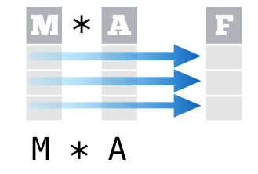
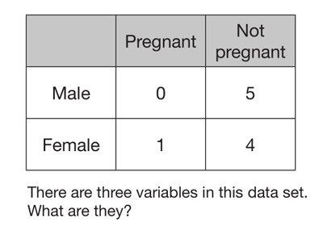
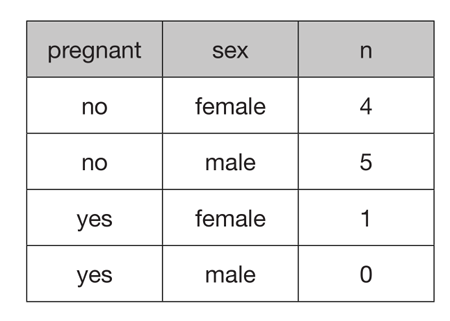

# Intro

If you start using R for some real work, you'll soon find out that
there is a whole huge universe of packages in R. That's why so many people like it so much.
And that's also where most of the problems come from - inconsistencies between the various packages.

Luckily someone is quite successful in fixing that. [Hadley Wickham](http://hadley.nz/) started to build his own universe inside the bigger one about 10 years ago. Someone called it 'Reinventing R from inside R'. 
He started to create packages that work well with each other. Just recently a new package called `tidyverse`
was [relaesed](https://blog.rstudio.org/2016/09/15/tidyverse-1-0-0/). It's actually a collection of packages well supporting each other - many of them by Hadley, but other authors also quickly jumped on board.

> For you who don't know much R now it's the best time to choose the right universe ;)

Running `library(tidyverse)` has the same effect as 

```
library(readr)    # for data import.
library(tidyr)    # for data tidying.
library(dplyr)    # for data manipulation.
library(ggplot2)  # for data visualisation.
library(purrr)    # for functional programming.
library(tibble)   # for tibbles, a modern re-imagining of data frames.
```

Additionally `tidyverse` brings some more packages with it, but does not load them by 
default. When you get used to the tidy universe, you're not willing to leave it...

# Tidy data
As the name `tidyverse` suggests, this universe revolves around something tidy. The tidy thing
here is the **data**. A conceptual definition of tidy data is that there is 
**one row** per one **observation** and **one column** per one **variable**. Other formulation 
is that the data of the *same kind* are in a single column (think measuring device, units..).


You often want to combine more features to get 'better' features ;) You combine features per observation
- and transformations in the tidy format lead to R's fast (vectorized) operations. More on this later.



> The essay on tidy data - which is a must-read - can be reached by `vignette("tidy-data")`.

## Challenge {.tabset}

### Task

Most of "biological" data are not in the tidy format, for example this:



### Solution

The three variables are **sex**, **pregnant** and the **count**. 




