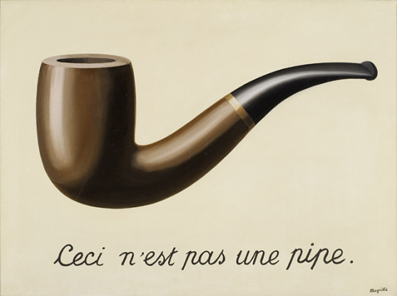
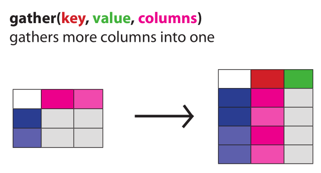
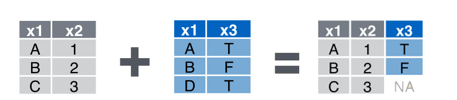
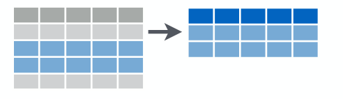
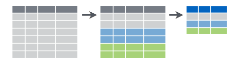

```{r setup, include=FALSE}
library(tidyverse)
```

# Preparing data

To prepare data for analysis in R you need to **load** it and **transform** it so it 
suits your question / plots. You want to **check** if all the steps are fine with the current
dataset.

We'll be staying in the tidy universe, that is:

  * all data are passed around in `data.frame`s
  * refer to the columns with unquoted names (most of the time)
  * do not change values of columns, we add columns with new values
  * do not even change the original `data.frame`s, save the modified results to new variables instead
  * keep the number of variables reasonable by chaining the commands
  
> Keep your [*Data Wrangling*](https://www.rstudio.com/wp-content/uploads/2015/02/data-wrangling-cheatsheet.pdf) cheat sheet at hand

# Artistic intermezzo



[René Magritte](https://en.wikipedia.org/wiki/Ren%C3%A9_Magritte) (1898-1967), Belgian surrealist 

When you transform your data, you mostly think in a linear fashion.

```
I load the data <then> I fix the format to tidy <then> I add a new variable <then> I save it to a variable
```

There is a language construct in R which allows you write your code in this way. It's called
`magrittr` and written like `%>%`.

> The weird name is a pun - in UNIX there is a thing called a `pipe`, `magrittr` behaves like a pipe, but it's not written as a pipe (`|`, because of R language restrictions).

`magrittr` actually calls the next function, so it cannot be used for the last step in my example. But R already has a solution to that - the right hand assignment `->`. It is weird and uncommon, but here it serves it's purpose very well. And it's not confusing, because the arrow tells you visually what happens.

```
I load the data %>% I fix the format to tidy %>% I add a new variable -> I save it to a variable
```

To be technically correct:

```
f(g(x), z)
```

Is equivalent to:

```
x %>% g %>% f(z)
```

# readr
Some of the inconsistencies I mentioned earlier start with loading of data. What you get by 
using `readr` functions instead of the basic ones?

  * (much) faster loads and progress indicator for big data sets
  * if you 'print' the data to console, they'll be nicely formatted
  * nice parsing errors
  * reasonable string handling
  * consistent behavior and argument naming

```
read_tsv("data/sc_2016_r_sample_data.csv")
```

`tibble` console formatting is nice, but (still) the data viewer in R Studio is more convenient.

```
read_tsv("data/sc_2016_r_sample_data.csv") %>% View
```

There is something fishy about the data - column named `Taxon` contains sample names. Actually sample names and some index. And the taxons are in the column names. Enter `tidyr`.

# tidyr

The first shortcoming is the sample names in `Taxon` column. We'll `separate` the two variables that are contained - sample name and a sampling 'type' code. The original column will be removed by `separate`.

```
read_tsv("data/sc_2016_r_sample_data.csv") %>% 
  separate(Taxon, c("sample", "sampling_timepoint")) %>%
  View
```

The next untidiness is that 'OTU counts' are in many columns, while I'd like them to be in a single column. This is where `gather` helps to put the data to'gather ;)



The `columns` specification is the same as you can use for `select` (see the Data Wrangling)
cheat sheet.

In our case:

```
read_tsv("data/sc_2016_r_sample_data.csv") %>% 
  separate(Taxon, c("sample", "sampling_timepoint")) %>%
  gather(taxon_code, `count`, -sample, -sampling_timepoint) ->
  dlong
```

# dplyr

Short code names are for machines. We need something people can understand. There is another table describing what do the `taxon_code`s mean, let's use it.

```
read_tsv("data/sc_2016_r_taxon_data.csv") %>% View
```

There is an accented column name in the data file. The easy way to deal with it is not to 
load it at all (using `skip` and supplying own column names).

```
# let's deal with the ugly character in column name before it's even loaded
read_tsv("data/sc_2016_r_taxon_data.csv",
          col_names = c("Taxon", "taxon_name"),
          skip = 1) -> 
  dtaxons

dlong %>%
  left_join(dtaxons, by=c("taxon_code"="Taxon")) ->
  dannot

```

What just happened?



> A thing on naming: keeping your whole projects organized and using 
> magrittr pipelines allows you to use very simple variable names, because you need
> like 5 for the whole analysis. I tend to prefix my dataframes with `d`, or use just `d`.
> (This doesn't hold for function argument names;)

The last thing remaining unexplained in the data are the time points. 

   sampling_timepoint | sampled
----------------------|-------------------
   1                  | before treatment
   2                  | 2 weeks after treatment
   3                  | 3 months after treatment

How do we get this into our table? Either create a `data.frame` and join it as in the previous example. Before joining data, **check the data types** of the fields used as keys, `"1"` is not `1` (ie `character` will not match `numeric` or `integer`, even if all display as `1`)!

```
data.frame(
  sampling_timepoint = c("1", "2", "3"),
  sampled = c("before treatment", "2 weeks after treatment", "3 months after treatment")) ->
  dtimes
```

You can join the annotations with `left_join` as an exerciser.

The other way which may come handy some time is a named look-up in a vector:

```
timepoints <- c("1" = "before treatment", 
                "2" = "2 weeks after treatment", 
                "3" = "3 months after treatment")

dannot %>%
  mutate(sampled = timepoints[sampling_timepoint]) ->
  dparadontosis

```

## quick summaries with dplyr

#### I want number of taxons that were above 100 at `before treatment` for each sample.

```
dparadontosis %>%
  filter(sampling_timepoint == "1",
         count > 100) %>%
  group_by(sample) %>%
  summarise(n = n())
```

### What happened here?

First `filter` picks all rows that match all of the conditions.



Then `group_by` 'marks' which rows should be grouped together (based on having the same value in the `sample` field).



And `summarise` produces one value per group, here using the `n()` function which ignores the values and only counts rows in each group.


******

#### I want the number of taxons that were persistent throughout the treatment (ie all 3 timepoints).

Decomposing the problem:

  * for each taxon and sample (`group_by`) I want to count (`summarise`) the non-null (`filter`) time points
  * I want only those that were present in all of them (`filter`)
  * then I want a summary on these taxons (one row per each -> `group_by`)
  * then sort it (`arrange`) just for presentation

```
dparadontosis %>%
  filter(count > 0) %>%
  group_by(sample, taxon_name) %>%
  summarise(ntimepoints = n()) %>%
  filter(ntimepoints == 3) %>%
  group_by(taxon_name) %>%
  summarise(nsamples = n()) %>%
  arrange(desc(nsamples)) %>%
  View
```
