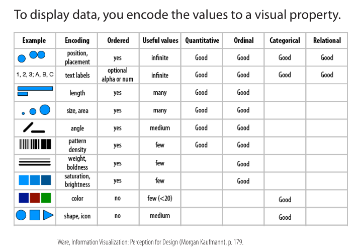

---
output:
  html_document:
    fig_width: 5
    fig_height: 4
---

```{r setup, include=FALSE}
library(tidyverse)

timepoints <- c("1" = "before treatment", 
                "2" = "2 weeks after treatment", 
                "3" = "3 months after treatment")

read_tsv("data/sc_2016_r_sample_data.csv") %>% 
  separate(Taxon, c("sample", "sampling_timepoint")) %>%
  gather(taxon_code, `count`, -sample, -sampling_timepoint) %>%
  left_join(read_tsv("data/sc_2016_r_taxon_data.csv",
                     col_names = c("Taxon", "taxon_name"),
                     skip = 1),
            by=c("taxon_code"="Taxon")) %>%
  mutate(sampled = timepoints[sampling_timepoint]) ->
  dparadontosis

```

# Grammar of graphics

_The `gg` in `ggplot`._

> Summaries in tables are ok, but the fastest understanding of the dataset is usually facilitated by images.




`ggplot2` is a package implementing the _Grammar of graphics_. It makes it easy to connect a column in your data to a graphic property. This is just a brief introduction.

We'll use a built-in data set `mtcars`, mapping `hp` (horsepower) to `x` and `mpg` (miles per gallon) to `y` of `point` geometry:

```{R}
mtcars %>% 
  ggplot(aes(hp, mpg)) + 
  geom_point()
```

We can map some more data to 'remaining' properties - like `cyl` (number of cylinders) to colour:
```{R}
mtcars %>% 
  ggplot(aes(hp, mpg, colour=cyl)) + 
  geom_point()
```

But this is not the intended result, number of cylinders is rather a factor, let's fix it:
```{R}
mtcars %>% 
  mutate(cyl = as.factor(cyl)) %>%
  ggplot(aes(hp, mpg, colour=cyl)) + 
  geom_point()
```

# Our data

The main advantage of using ggplot is the ability to quickly iterate over many types of plots and transformations, as the data exploration requires.

```{R, message = FALSE, warning = FALSE}
dparadontosis %>%
  ggplot(aes(count)) +
  geom_histogram()
```

Zoom to the region close to `0`. Why the peak is now smaller?

```{R, message = FALSE, warning = FALSE}
dparadontosis %>%
  ggplot(aes(count)) +
  geom_histogram() +
  xlim(-5, 200)
```

Check if there is any difference between the samples. Get rid of the zeroes before plotting.

```{R, message = FALSE, warning = FALSE}
dparadontosis %>%
  filter(count > 0) %>%
  ggplot(aes(count)) +
  geom_histogram() +
  xlim(-5, 200) +
  facet_wrap(~sample, ncol = 1, switch = "y")
```

Did we eradicate some species during treatment? (Approximate approach.)

```{R}
dparadontosis %>%
  filter(count > 0) %>%
  group_by(sample, sampled) %>%
  summarise(nspecies = sum(count > 0)) %>%
  ggplot(aes(sampled, nspecies, colour = sample, group = sample)) +
  geom_line() +
  geom_point()
```

You will always iterate on your plots when they get a bit complex. Let's fix the order.

```{R}
dparadontosis %>%
  mutate(sampled = factor(sampled, 
                          levels = c("before treatment",
                                     "2 weeks after treatment",
                                     "3 months after treatment"))) %>%
  group_by(sample, sampled) %>%
  summarise(nspecies = sum(count > 0)) %>%
  ggplot(aes(sampled, nspecies, colour = sample, group = sample)) +
  geom_line() +
  geom_point()
```

Species-wise it does not look very promising...what about abundances? And fix the labels...

```{R}
dparadontosis %>%
  mutate(sampled = factor(sampled, 
                          levels = c("before treatment",
                                     "2 weeks after treatment",
                                     "3 months after treatment"))) %>%
  group_by(sample, sampled) %>%
  summarise(nseqs = sum(count)) %>%
  ggplot(aes(sampled, nseqs, colour = sample, group = sample)) +
  geom_line() +
  geom_point() +
  theme(axis.text.x = element_text(angle = 8, hjust = 1))
```

Pick the most abundant species, show top 20.

```{R,  fig.width=9}
library(forcats)
dparadontosis %>%
  mutate(taxon_name = fct_reorder(taxon_name, count, fun=sum),
         sampled = factor(sampled, 
                          levels = c("before treatment",
                                     "2 weeks after treatment",
                                     "3 months after treatment"))) %>% 
  filter(taxon_name %in% rev(levels(taxon_name))[1:20]) %>%
  ggplot(aes(taxon_name, count, fill=sampled)) +
  geom_bar(stat="identity") +
  facet_wrap(~sample) +
  coord_flip() +
  scale_y_continuous(breaks = c(0, 2500, 5000))
```
